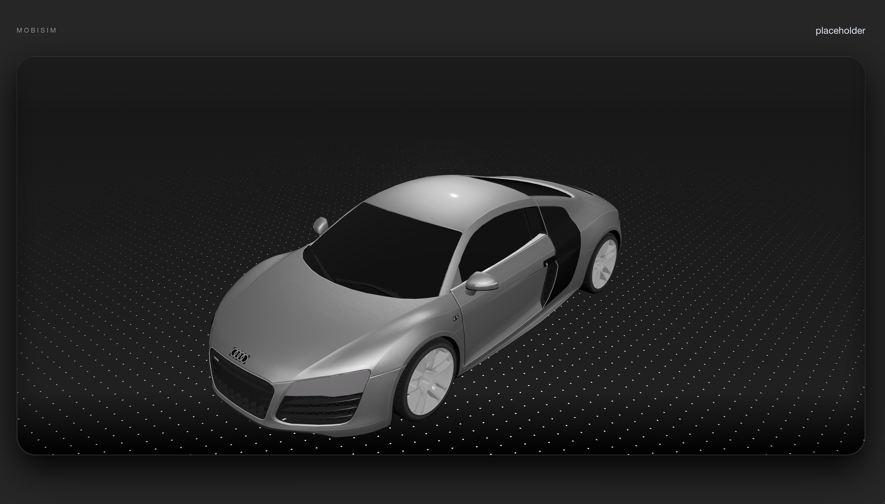
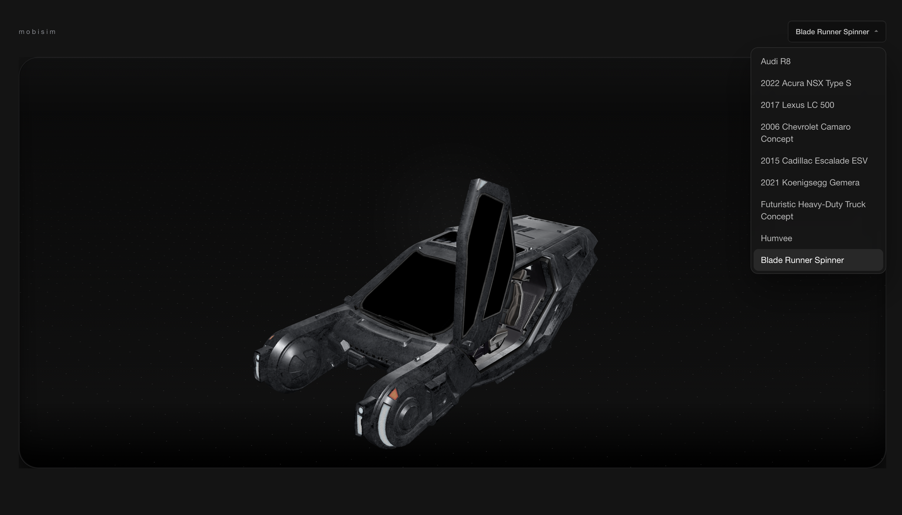
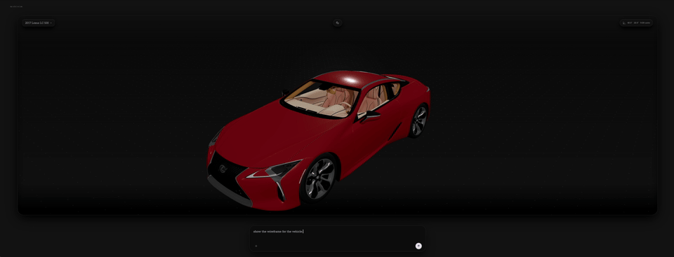

# Mobisim

Minimal SvelteKit viewer shell for a Chrome-first 360-degree vehicle inspection experience.

## Progress





## Development

```sh
npm run dev
```

## Building

```sh
npm run build
```

## Tests

```sh
npm test
```

See [docs/GUIDE.md](/Users/prateek/code/robotics/mobisim/docs/GUIDE.md) for project conventions and [docs/STATE.md](/Users/prateek/code/robotics/mobisim/docs/STATE.md) for open work.
