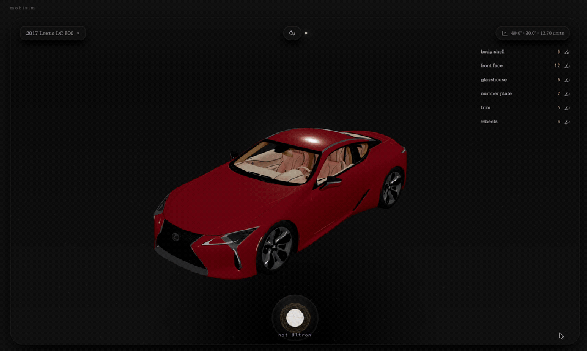

# Mobisim

Minimal SvelteKit viewer shell for a Chrome-first 360-degree vehicle inspection experience.

## Progress




## Development

```sh
npm run dev
```

GitHub auth env required for the gated app shell:

```sh
AUTH_SECRET=...
AUTH_TRUST_HOST=true
AUTH_GITHUB_ID=...
AUTH_GITHUB_SECRET=...
```

For a local OpenTelemetry dashboard backed by Grafana LGTM:

```sh
npm run observability:up
npm run dev:otel
```

Then open `http://localhost:3000` and inspect traces/metrics for `mobisim-web`.

## Voice Orb

The footer orb now mirrors the footer textbox through a microphone-driven path:

- Click once to start recording in Chrome.
- Click again to stop and execute.
- The orb transcribes the utterance, runs the same vehicle chat executor, applies the same patch/selection effects, and plays back a synthesized reply.

Configure these environment variables when you want to override the default audio models:

```sh
OPENAI_TOOL_MODEL=gpt-5.2
OPENAI_REPLY_MODEL=gpt-4o-mini
OPENAI_AUDIO_TRANSCRIBE_MODEL=gpt-4o-mini-transcribe
OPENAI_AUDIO_TTS_MODEL=gpt-4o-mini-tts
OPENAI_AUDIO_TTS_VOICE=alloy
```

Routing defaults:

- `OPENAI_TOOL_MODEL` drives planning, tool choice, and tool chaining for footer chat and voice requests.
- `OPENAI_REPLY_MODEL` drives short Jarvis-style reply polishing when the audio path needs a spoken summary.
- `OPENAI_MODEL` remains a legacy fallback for older deployments that have not split the model config yet.

## Building

```sh
npm run build
```

## Tests

```sh
npm test
```

Telemetry config coverage lives at [config.test.ts](/Users/prateek/code/robotics/mobisim/src/lib/server/telemetry/config.test.ts).

## Semantic Overlay

The GLB-derived structural manifest remains the source of truth for IDs, paths, meshes, and validation.

To generate a one-pass semantic overlay for an asset, configure `OPENAI_API_KEY` and call:

```sh
curl -X POST http://localhost:5173/api/vehicle-assets/ks_blade_runner_spinner/semantic-overlay
```

The accepted overlay is stored separately under `storage/vehicle-semantic-overlays/` by default, or `SEMANTIC_MANIFEST_LOCAL_DIR` when configured.

The footer chat tool loop now uses stale-while-revalidate semantics:

- Explicit semantic refresh requests wait for completion.
- Semantics-sensitive edit requests reuse the current overlay if present and start a deduped background refresh when the overlay is missing or stale.
- Structural validation remains synchronous and authoritative.

## Context History

User-specific footer chat context can be backed by DynamoDB in production and DynamoDB Local for local/demo runs.

Local Docker path:

```sh
npm run context-history:up
CONTEXT_HISTORY_STORE=dynamodb \
CONTEXT_HISTORY_TABLE=mobisim-context-history \
DYNAMODB_ENDPOINT=http://127.0.0.1:8000 \
AWS_REGION=us-west-2 \
npm run context-history:bootstrap
```

The context layer resolves memory in this order:

- current request context
- current asset snapshot
- current asset recent history
- user-global summary

See [docs/GUIDE.md](/Users/prateek/code/robotics/mobisim/docs/GUIDE.md) for project conventions and [docs/STATE.md](/Users/prateek/code/robotics/mobisim/docs/STATE.md) for open work.
