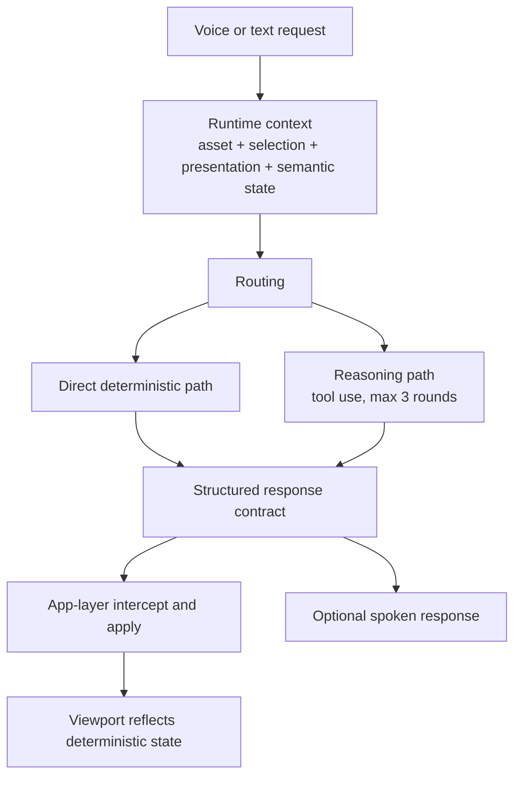

# mobisim [Live App](https://mobisim.dunkeln.com/app/inspect/audi_r8)

Mobisim is a browser-native vehicle understanding system that turns a 3D vehicle asset into an inspectable, semantically grounded interface with a voice/text copilot.

It is Chrome-first, deterministic at the mutation boundary, and scoped to one active vehicle at a time.

Raw meshes are hard to inspect and harder to operate safely through natural language. Mobisim adds structure, semantic grounding, and controlled execution so a vehicle can be reviewed visually and acted on through stable app behavior instead of fragile mesh-name guessing.

## Table of Contents

- [What Mobisim Is](#what-mobisim-is)
- [How It Works](#how-it-works)
- [System Layers](#system-layers)
- [FRIDAY Execution Model](#friday-execution-model)
- [What You Can Do](#what-you-can-do)
- [Deployment Shape](#deployment-shape)
- [Further Docs](#further-docs)

## What Mobisim Is

Mobisim combines a realistic browser inspection viewport with FRIDAY, a grounded copilot that can inspect, explain, and apply asset-scoped changes through text or voice.

- one active GLB vehicle loaded into a Chrome-first inspection route
- orbit inspection with click-based grounding
- text chat and voice requests routed through the same execution surface
- deterministic presentation and semantic operations applied through the app layer
- graceful failure when a request falls outside the supported inspection surface

## How It Works

Mobisim turns a raw 3D vehicle into an operable interface through a short structured pipeline:

`3D vehicle asset -> structural DAG -> semantic overlay -> active inspection asset`

- the structural layer captures node IDs, mesh details, materials, and hierarchy
- the semantic overlay groups raw structure into stable part vocabulary such as wheels, body, or lights
- the active inspection route loads the asset plus live state needed for grounded interaction
- FRIDAY reads that state instead of inventing hidden scene context

## System Layers

Mobisim keeps runtime behavior grounded by separating three state layers:

- presentation layer: reversible visual changes such as paint, tint, highlights, isolation, and viewer debug modes
- cursor selection: the currently selected nodes or semantic targets used for grounding requests like "this" or "these"
- backend-stored semantic data: persistent semantic overlay data used as the durable source of truth for asset meaning

These layers are collated into runtime context, but they remain distinct so visual edits, user selections, and stored semantic knowledge do not bleed into each other.

## FRIDAY Execution Model

FRIDAY is an inspection copilot, not a general chatbot. It operates on one active asset at a time and resolves requests against live scene state.

- shortcut path: direct deterministic handling for requests such as restore, direct semantic edits, or stable REST-backed asset changes
- reasoning path: tool-based planning when the request needs deeper interpretation or multi-step resolution
- app-layer intercept: the client applies approved changes and remains the mutation boundary
- failure mode: unsupported or invalid requests return a graceful null-style result instead of fabricated commitment

## What You Can Do

- inspect a realistic vehicle from all angles with orbit controls
- click parts to ground follow-up instructions
- chat or speak to FRIDAY against the active vehicle context
- change presentation state with paint, tint, highlight, isolate, and restore operations
- use deterministic viewer modes such as wireframe, UV debug, and X-ray
- operate on semantic groups instead of depending on brittle mesh names

## Deployment Shape

The system stays intentionally lightweight:

- browser app for the inspection surface
- REST API for vehicle and chat operations
- S3-backed storage for browser-facing assets and semantic data
- user-scoped and asset-scoped chat/context storage
- small-container deployment shape proven against AWS-style infrastructure

## Further Docs

- [docs/GUIDE.md](/Users/prateek/code/robotics/mobisim/docs/GUIDE.md) for the shortest safe technical handoff
- [docs/ENDPOINTS.md](/Users/prateek/code/robotics/mobisim/docs/ENDPOINTS.md) for the current REST surface
- [docs/STATE.md](/Users/prateek/code/robotics/mobisim/docs/STATE.md) for state boundaries and cleanup notes
